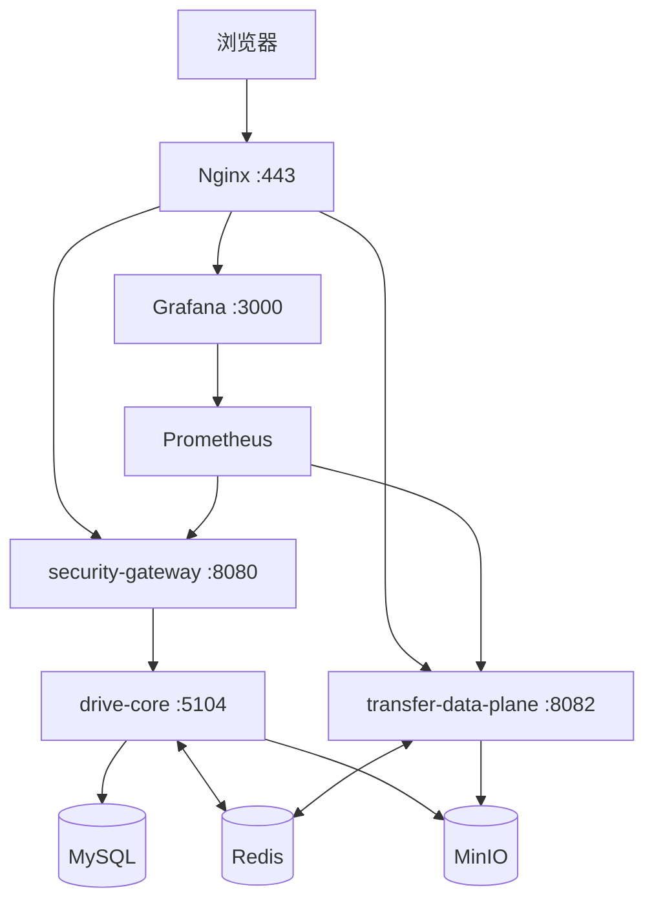
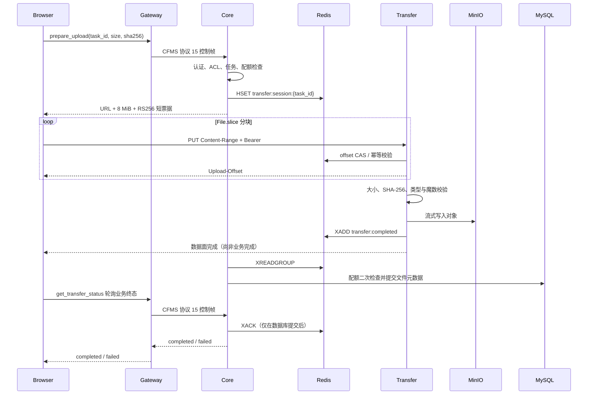

# 网盘攻防战：微服务化演进架构

## 架构结论

本项目采用“三个应用服务 + 基础设施”的微服务化演进架构，不按业务名词机械拆分服务。

| 服务 | 事务与数据所有权 | 独立部署理由 | 明确不负责 |
|---|---|---|---|
| `security-gateway` | 公网 WebSocket、WAF、限流、关联审计、实验开关 | 公网风险与控制流负载可独立扩缩、降级 | 文件字节和 Core 业务数据库 |
| `drive-core` | 身份、目录、ACL、版本、回收站、搜索、分享、配额、传输授权 | 强事务关系留在同一边界，避免分布式事务 | 新 HTTP 文件分块 |
| `transfer-data-plane` | Redis 临时传输会话、MinIO 文件对象 | 大文件 I/O、内存模型与控制面不同 | 用户密码、ACL 和 Core 数据库 |

Java 服务不是为了“换语言”而拆。网关隔离公网安全策略，数据面隔离大文件 I/O；身份、ACL、目录、分享和配额仍由 Python 模块化单体保持事务一致性。

## 部署拓扑

只有 Nginx 暴露宿主端口。Core、MySQL、Redis、MinIO 和 Prometheus 位于内部网络；应用容器使用非 root 用户和 `no-new-privileges`。Core 与 Gateway 的内部 WSS 使用专用证书，Gateway 不启用 trust-all。

## 上传控制流

浏览器与 Transfer 单次工作块上限为 8 MiB。浏览器把会话和 offset 保存到 IndexedDB，断线后先用 `HEAD` 获取服务端 offset；数据面返回 `201` 后仍需轮询 Core，只有 MySQL 文件事务完成才提示上传成功。下载使用 HTTP Range 和浏览器原生写盘，响应流成功结束后才把下载会话标为完成。

## 信任与一致性边界

- Core 持 RS256 私钥，Transfer 只挂载公钥。
- 票据固定 RS256，校验 issuer、audience、过期时间，并绑定 `task_id`、用户、操作、对象键和最大大小；`jti` 是随机票据标识，不等于任务 ID。
- Redis 会话是短期能力状态，MySQL 文件记录才是业务事实。
- 完成事件至少一次投递；Core 数据库事务成功后才 ACK，重复事件幂等处理。
- Core 根据受 ACL 保护的 Document 生成文件名和 MIME；客户端自报元数据不能影响 Transfer 类型策略。
- 配额二次拒绝或 Transfer 回滚失败时，Core 先幂等删除 MinIO 对象；删除失败保留未 ACK 事件，恢复后继续清理。
- 分享下载次数在票据签发事务中原子占用，不能在下载完成后再增加；同一短票据在 TTL 内可用于浏览器的多个 Range 请求，不重复占用次数。
- 管理 API 使用独立管理员令牌；浏览器仅在当前标签页的 `sessionStorage` 保存。

## 重名并发修复

旧路径是“查重后插入”，两个并发请求可能同时通过。上传前文档又处于 `active=false`，第二个请求还可能把第一个请求的占位 revision/task 当成垃圾清理。

当前策略：

1. 创建、重命名、移动和恢复共享同一父目录命名临界区。
2. MySQL 对稳定的父目录行执行 `SELECT ... FOR UPDATE`，同时覆盖文档表与目录表。
3. SQLite 测试环境使用有界进程内目录锁，因为 SQLite 忽略 `FOR UPDATE`。
4. 文档、首个 revision 和上传任务在同一事务提交；有效上传任务的占位文档继续占用名称。
5. 回归测试要求“文档对文档”和“文档对目录”均严格一个成功、一个 `409`。

## 故障隔离

| 故障 | 预期行为 |
|---|---|
| Transfer 停机 | 登录、浏览、ACL、搜索继续可用；上传下载明确失败 |
| Core 停机 | 网关健康和管理面继续可观测；控制请求返回明确错误 |
| Redis 短暂重启 | 未 ACK 事件恢复消费；上传按服务端 offset 续传 |
| MinIO 写失败 | 不生成 completed 文件记录 |
| WAF 日志磁盘变慢 | 有界队列限制内存并暴露 backlog/drop/failure 指标 |

## 实验口径

控制面对比 WSS 直连、Gateway/WAF 关闭、Gateway/WAF 开启；数据面对比旧 WSS 与新 HTTP Range/Content-Range。记录吞吐、TTFB、完成时间 p50/p95/p99、错误率、CPU、RSS、浏览器峰值内存、事件积压和 SHA-256 正确性。

性能门槛是待实测的验收条件，不是设计结论。文件链路应准确表述为 HTTPS/WSS 传输加密与 SHA-256 完整性保护；旧链路密钥和密文经同一 WSS 通道，不称为端到端加密。
