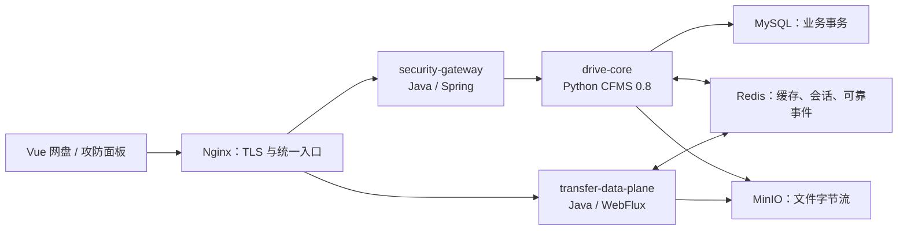

# 我的网盘攻防战（Thesis Drive）

面向毕业设计与安全教学的网盘：完整业务控制面、独立文件数据面、安全网关、可控靶场与可观测性能实验组成一条可复现的“攻击 → 告警/拦截 → 加固 → 对比”闭环。

> 默认是安全模式。漏洞开关只有在 `LAB_MODE=true` 的隔离实验环境中才会生效；不要把 `course-unprotected` 或 `unprotected` profile 暴露到公网。

## 架构



- `security-gateway`：WebSocket 公网边界、WAF、限流、关联审计、实验开关和管理鉴权。
- `drive-core`：认证、ACL、目录、版本、回收站、搜索和传输授权；`thesis` 支线已包含 CFMS 上游 `master@941404c`，后续定制均落在该支线。
- `transfer-data-plane`：8 MiB 有界分块、断点续传、HTTP Range、RS256 票据、MinIO 和 Redis Stream；不访问 Core 数据库。

Java 的拆分依据是安全边界和负载特征，而不是“为了换语言”：公网安全策略与大文件 I/O 可以独立扩缩、限流和故障处理；身份、目录、ACL 等强事务模块仍留在 Python 模块化单体中。

## 一键启动（Linux / Docker Compose）

要求 Docker Engine 与 Docker Compose v2。根目录执行：

```bash
cp .env.example .env
# 先替换 .env 中全部 change-this-* 开发口令，再启动服务
docker compose --env-file .env --env-file profiles/hardened.env up --build -d
docker compose ps
```

打开 `https://localhost`。开发证书是镜像构建时生成的自签证书，首次访问需由浏览器确认。Grafana 位于 `https://localhost/grafana/`。默认只监听 `127.0.0.1`；内网靶场请按 [攻防阶段内网部署手册](LAN_DEPLOYMENT.md) 显式选择网卡、生成口令和证书 SAN。

开发证书默认只覆盖本机入口。内网脚本可为指定 IP/DNS 增加 SAN；正式环境仍应使用匹配域名的受信任证书。

首次管理员密码：

```bash
docker compose exec drive-core cat /app/state/admin_password.txt
```

WAF/漏洞管理面板需要 `.env` 中的 `CARAPACE_ADMIN_TOKEN`，令牌只保存在浏览器 `sessionStorage`。

切换实验 profile 后重建网关：

```bash
docker compose --env-file .env --env-file profiles/baseline.env up -d --force-recreate drive-core security-gateway
```

可选 profile：

- `hardened`：漏洞关闭，WAF 全开（默认答辩入口）。
- `baseline`：隔离漏洞模拟保持开启，WAF 全开（用于采集拦截证据）。
- `course-unprotected`：九项课程任务所需的隔离模拟开启、WAF 关闭，扩展高危端点保持关闭。
- `unprotected`：包括 SSRF/JNDI 等扩展实验在内的全部漏洞开启、WAF 关闭，仅用于另行授权的隔离专项靶场。

停止服务保留数据用 `docker compose down`；只有明确要清空实验数据时才使用 `docker compose down -v`。

## 本地验证

```powershell
./scripts/verify.ps1
```

或分别执行：

```powershell
# drive-core
Set-Location cfms_on_websocket-master
uv venv --python 3.14 .venv
uv pip install --python .venv/Scripts/python.exe -e '.[cluster,mysql,ext_oidc_sso]' --group dev
.venv/Scripts/python.exe -m pytest -q

# security-gateway / transfer-data-plane
../carapace/gradlew.bat test bootJar
../transfer-data-plane/gradlew.bat test bootJar

# frontend
Set-Location ../thesis_frontend
npm ci
npm test
npm run build
```

当前实现证据和待完成实验见 [EVIDENCE.md](EVIDENCE.md)，详细设计见 [MICROSERVICE_ARCHITECTURE.md](MICROSERVICE_ARCHITECTURE.md)。2026-09-08 已融合 CFMS 0.8.0 / 协议26，并补测本地与服务器裸服务、集成控制面及完整HTTPS文件路径；原始数据、失败记录和汇总见 [本次测评记录](benchmarks/records/2026-09-08/summary.json) 与 [运行说明](benchmarks/README.md)。现网保留上传消费修复，新版本在独立实例验证；现网旧库升级需另做MySQL迁移演练。

## 安全与论文表述

- 传输票据为 RS256，绑定 `task_id、username、operation、object_key、max_size、jti、exp`，Core 只分发短期票据，Transfer 只持公钥。
- 上传完成使用 Redis Stream 消费者组；Core 数据库事务成功后才 ACK，重复事件必须幂等。
- 文件链路应表述为 HTTPS/WSS 传输加密与 SHA-256 完整性保护，不宣称端到端加密。
- MySQL、Redis、MinIO、Core 均无宿主端口，仅 Nginx 暴露 `80/443`。
